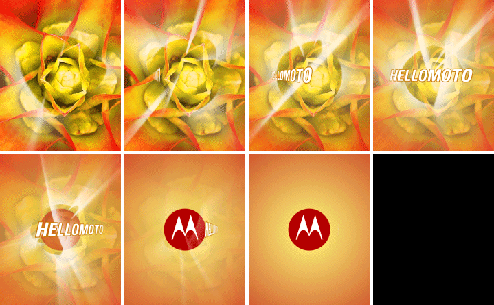

# V600 emulator

A low-level emulator for the **Motorola V600** (2004), a flip phone I've always loved. This is a
passion project: the goal is to run the phone's real firmware, unmodified, and use it again on a
computer, from the boot animation through the menus.



## What works

- Real firmware (`TRIPLETS_G_0B.09.38R`) boots on an emulated big-endian ARM7TDMI (Neptune LTE
  baseband), through the full startup animation to the standby screen.
- Interrupt controller, timers, PCAP2 power chip (ADC, interrupts), battery ID chip (DS2502 over
  one-wire), keypad, flip sensor.
- ATI Imageon W2250 graphics: command ring and the 2D engine operations the UI uses (blits, fills,
  lines, mono glyph text).
- A virtual GSM SIM card on the emulated SIM interface: the phone completes SIM start-up,
  reaches the idle screen ("No Service") and its menus can be navigated.
- Sound: key clicks, the power-up tune, tone, MIDI and MP3 ringtones. The phone's DSP runs
  from ROM we don't have, so its audio side is recreated from the commands the firmware
  sends it (`v600/audio.py`, MIDI synthesis in `v600/midi.py`; MP3 is decoded by the browser).
- The camera app opens (black viewfinder: the sensor answers, but makes no picture yet).
- Runs in real time in a browser with clickable keys (`tools/live.py`); press "Sound" on the
  page to hear it.

| Idle | Menu | Screensaver |
|---|---|---|
|  |  |  |

## Running it

The firmware is not included. You need your own V600 firmware dump as a Motorola superfile at
`firmware/v600.shx`. Once, to set up:

```bash
python3 -m venv .venv && .venv/bin/pip install -r requirements.txt
```

The emulator core is C (`core/`); `./phone` builds it with `make` (Xcode command line tools
or any C compiler).

Then:

```bash
./phone          # the phone in your browser (http://localhost:8600)
./phone test     # boot headless and check the main features: PASS / FAIL, about 30 s
./phone drive 45.0 menu +2.0 shot:menu   # a scripted headless session (see tools/drive.py)
```

The page has the keypad, the display, and controls: **Sound**, **Close / Open flip**,
**Save now**, **Restart** (reboot, keeping the saved state) and **Factory reset** (delete the
saved state and boot the firmware as shipped). The outer display (the clock on the lid) is shown
beside it. With the flip closed the phone behaves as it does closed: the main screen is dark,
only the side keys (volume, voice, smart) can be pressed, and the phone uses the outer display.

Keyboard: digits, `*` `#`, arrows, Space = OK, Enter = green key, Esc = red key (hold to
switch off), F1/F2 = soft keys, M = menu, +/- = volume.

Changes the phone makes to its flash (settings, contacts, messages) are saved to
`state/flash.bin` every few seconds and on exit, and restored next time.

`./phone test` boots from the firmware as shipped (it never touches `state/`) and checks: the
idle screen, registering on the pretend network, the menu, the ringing tone, an outgoing call
(set up, answered, hung up) and the outer display. Screenshots go to `out/selftest/`.

## Layout

- `v600/`: the machine (memory map, CPU loop, interrupts) and hardware models.
- `tools/`: live mode, tracers, disassembly and symbol helpers.
- `PLAN.md`: approach and progress log. `HARDWARE.md`: every register learned and how.

## Next

- Incoming calls and text messages from the pretend network; the call voice path.
- Key-press tones (silent so far), the real-time clock (the phone shows 0:00), a camera picture.

This is an independent hobby project, not affiliated with or endorsed by Motorola.
